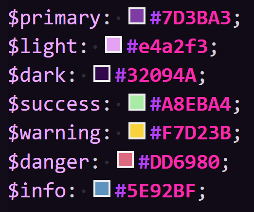

# **AboutMe**

# Introduction

AboutMe is a site for sharing images. 

On the site, users can share their stories in images in combination of text posts.

Users are able to follow their favourite people to easily find their content on the front page, and perhaps upload comment encouraging words on the posts they like.

# Features and UX

## **UX**

### **Typography**

I wanted to choose an easy-to-read font with a modern feel and chose Glacial Indifference, both regular and bold variants.

### **Colours**

Below are the main colours used on the site:

I chose these colours specifically as they are picked from the colours present in the background image.

### **User Stories**

* **User Story 1**: As a site user, I want to register an account to be able to post content and interact with others' content.
* **User Story 2**: As a site user, I want to be able to eaily change my account information.
* **User Story 3**: As a site user, I want to be able to share images to others.
* **User Story 4**: As a site user, I want to be able to follow other users whose content I enjoy.
* **User Story 5**: As a site user, I want to share text content with my photos.
* **User Story 6**: As a site user, I want to be able to easily edit my posts' text content.
* **User Story 7**: As a site user, I want to group similar posts into collections.
* **User Story 8**: As a site user, I want to easily access the content of those I follow.
* **User Story 9**: As a site user, I want to show other users that I enjoy their content by liking their post.
* **User Story 10**: As a site user, I want to share my thoughts on others' posts by commenting on them.
* **User Story 11**: As a site user, I want to see the number of likes on posts to know how many enjoy my content.
* **User Story 12**: As a site user, I want to see how many followers I have.
* **User Story 13**: As a site user, I want to be able to easily remove my comments and posts.

### **Admin Stories**

* **Admin Story 1**: As a site admin, I can remove posts that violate the Terms of Use.
* **Admin Story 2**: As a site admin, I can remove users who repetadly violate the Terms of Use.
* **Admin Story 3**: As a site admin, I can remove comments violating the Terms of Use.

---

## **Features**

---

### **Landing Page**

When first opening the site, the user lands on the posts page

Here they have the opportunity to search posts based on their title

### **Login/logout**

If they aren't logged in since earlier they can do so by clicking the login button (or on mobile, the login link inside navigation menu).

This opens up the modal for login.

### **Signup**

If the user has no account and wish to create one, the login modal has a button toggling the signup modal.

Here they enter a username, email and password, and accept the terms of use as well as the privacy notice.

After creating an account, they may log in using the details provided.

### **Account Page**

To easily see and manage their own posts, and edit their account, the user can go to the account page.

Upon clicking the 'Edit Profile' button they are prompted with a profile editor modal.

If they wish to change their profile picture they are prompted with a cropping tool, to ensure the image will have a 1:1 aspect ratio and not get distorted.

Here they can zoom in/out and rotate the photo.

### **Following Users**

Users can follow each other by clicking the user icon with a plus, in the user detail page. If they already are following them there is a minus instead, with the text 'following' next to the username.

Following allows the user to now, on the post page, browse posts by the users they are following.

### **Tables**

As shown below I have implemented 7 different models to handle the variety of functionality on the site. Column for dark mode in accounts_profile is present, as I had planned to implement an optional dark mode on the site but decided it wasn't a priority for the time being as with the backgrount the site is relatively dark already. The paths that separate at the end represent many-to-one relationships and the single-line paths represent one-to-one relationships.

# ClickUp

For the project planning I used ClickUp to track my progress based on user/admin stories. I used different priority flags based on which order the different features should be implemented, as well as tagging to make it easier to distiguish between the features.

| Clickup at the start of project 	| Clickup at the end of project 	|
|:---:	|:---:	|
|  	|  	|

# Wireframes

Before starting the project, I did create some wireframes to use as a guide during development. I hadn't been able to imagine the whole end result and the layout differs slightly but it did help me with a rough idea of the result.

| Landing page 	| Search 	| Post 	|
|:---:	|:---:	|:---:	|
| ![landing page wireframe][start-wireframe] 	| ![searchbox wireframe][search-wireframe] 	| ![post page wireframe][post-wireframe] 	|

| Login prompt 	| Signup prompt 	| Account page 	|
|:---:	|:---:	|:---:	|
| ![login wireframe][login-wireframe] 	| ![signup wireframe][signup-wireframe] 	| ![account page wireframe][account-wireframe] 	|

# Testing

## **Manual testing**

**Methodology**

All the user and admin stories have been implemented and tested as shown below.

### **User Stories**

---------------

**As a site user, I want to register an account to be able to post content and interact with others' content.**

Implementation 🏭: In the login modal, there is a button allowing for users to sign up.

Test 🧪: I created a new user.

Result 🏆: Everything worked as expected, the user was created and logged in.

Verdict ✅: The test passed as everything worked as expected

---------------

**As a site user, I want to be able to eaily change my account information.**

Implementation 🏭: On the user's account pade there is a profile edit button where they have the option to update their profile picture, bio, username and email.

Test 🧪: I tried changing the profile photo, bio, username and email using the profile edit modal

Result 🏆: Everything worked as expected, values were immediately updated in the database and a confirmation message was shown

Verdict ✅: The test passed as everything worked as expected

---------------

**As a site user, I want to be able to share images to others.**

Implementation 🏭: On the user's account page there is an image upload button which opens up a modal where they may upload an image.

Test 🧪: I tried uploading photos on the site using the photo upload modal

Result 🏆: Everything worked as expected, the photo was saved with its title

Verdict ✅: The test passed as everything worked as expected

---------------

**As a site user, I want to be able to follow other users whose content I enjoy.**

Implementation 🏭: When logged in, a user icon with a plus sign is shown on others' profile page. Users can click this to follow that user.

Test 🧪: I tried following other users on the site using the follow button

Result 🏆: Everything worked as expected, my user was added to the followers of that user

Verdict ✅: The test passed as everything worked as expected

---------------

**As a site user, I want to share text content with my photos.**

Implementation 🏭: In the image upload menu, the user has the option to add text content to their post. In that case they may enter the text into the textarea field

Test 🧪: I uploaded an image with added text content

Result 🏆: Everything worked as expected, the text content was shown on the post page

Verdict ✅: The test passed as everything worked as expected

---------------

**As a site user, I want to be able to easily edit my posts' text content.**

Implementation 🏭: The user is able to edit their posts' text content using the inline editing tool. On the user's own post upon hover there is a pencil icon next to editable content

Test 🧪: I tried editing the titles and text contents of photos using the inline editing tool

Result 🏆: Everything worked as expected, the new content was updated to the post page

Verdict ✅: The test passed as everything worked as expected

---------------

**As a site user, I want to group similar posts into collections.**

Implementation 🏭: Adding an image is mandatory as part of the upload process, the user is also able to create new collections on that page

Test 🧪: I tested whether or not images were added to the chosen/new collection

Result 🏆: Image uploaded was added to the collection

Verdict ✅: The test passed as everything worked as expected

---------------

**As a site user, I want to easily access the content of those I follow.**

Implementation 🏭: On the Posts page, the user is able to filter posts of users they follow by clicking the "following" button in the button group

Test 🧪: I used the following filter on the Posts page

Result 🏆: Images shown were only of the users I followd

Verdict ✅: The test passed as everything worked as expected

---

**As a site user, I want to show other users that I enjoy their content by liking their post.**

Implementation 🏭: On the individual post page there is a button with a heart. Logged in users can click this to like the post. The total amount of likes is shown next to the button

Test 🧪: I used the button to like a post

Result 🏆: A like was added to the counter next to the heart icon

Verdict ✅: The test passed as everything worked as expected

---------------

**As a site user, I want to share my thoughts on others' posts by commenting on them.**

Implementation 🏭: On the individual post page at the bottom, there is a textarea where logged in users may upload a comment. This comment is then shown above the text area. Users who are not logged in can only see the comments

Test 🧪: I used the textarea to upload a comment on a post

Result 🏆: A comment was added above the textarea

Verdict ✅: The test passed as everything worked as expected

---------------

**As a site user, I want to see the number of likes on posts to know how many enjoy my content.**

Implementation 🏭: A like counter is shown next to the heart icon on an individual post page. This shows the total amount of likes the post has received

Test 🧪: I checked if the counter displays likes correctly

Result 🏆: The counter increased by one after liking, and decreased by one after unliking,

Verdict ✅: The test passed as everything worked as expected

---------------

**As a site user, I want to see how many followers I have.**

Implementation 🏭: On the account page, below the user's username the number of followers is displayed in slightly smaller text

Test 🧪: I checked if the counter displays followers correctly

Result 🏆: The counter increased by one after following the user, and decreased by one after unfollowing

Verdict ✅: The test passed as everything worked as expected

---------------

**As a site user, I want to be able to easily remove my comments and posts.**

Implementation 🏭: A rubbish bin is shown on a user's comments above their username/profile picture. Clicking this deletes the comment

Test 🧪: I checked if the comment got deletet upon clicking the rubbish bin

Result 🏆: The comment was deleted

Verdict ✅: The test passed as everything worked as expected

---------------

### **Admin Stories**

**As a site admin, I can remove posts that violate the Terms of Use.**

Implementation 🏭: A rubbish bin is shown on top of the post title on the individual post page for staff members. Clicking this deletes the post

Test 🧪: I checked if the after got deletet upon clicking the rubbish bin

Result 🏆: The post was deleted

Verdict ✅: The test passed as everything worked as expected

---------------

**As a site admin, I can remove users who repetadly violate the Terms of Use.**

Implementation 🏭: A staff member can navigate to the admin panel Users menu, where they can manually delete users. This is more difficult of a task in order to prevent accidental user deletions

Test 🧪: I checked if the user got deleted from the admin panel Users meny

Result 🏆: The user was deleted

Verdict ✅: The test passed as everything worked as expected

---------------

**As a site admin, I can remove comments violating the Terms of Use.**

Implementation 🏭: While regular users see a rubbish bin on top of only their comments, a staff member sees one on top of all comments and is able to delete a comment that way

Test 🧪: I checked if the comment got deleted after clicking the rubbish bin

Result 🏆: The comment was deleted

Verdict ✅: The test passed as everything worked as expected

---------------

## **Lighthouse**

# Dependencies

1. [**Django Client Side Image Corpping**](https://pypi.org/project/django-client-side-image-cropping/)
2. [**Django CORS-headers**](https://pypi.org/project/django-cors-headers/)
3. [**Django Inlineedit**](https://github.com/ptav/django-inlineedit)
4. [**Django Storages**](https://pypi.org/project/django-storages/)
5. [**Gunicorn**](https://pypi.org/project/gunicorn/)
6. [**Django Markdown**](https://pypi.org/project/django-markdown/)
7. [**Pillow**](https://pypi.org/project/Pillow/)
8. [**Python-decouple**](https://pypi.org/project/python-decouple/)
9. [**Selenium**](https://pypi.org/project/selenium/)
10. [**Whitenoise**](https://pypi.org/project/whitenoise/)

# Bugs

## **Fixed**

---------------

    Bug 🐝: Submitting any form would instead of submitting the form in question try to submit a login request

    Cause 🛠: Logging in was handled as a middleware which was looking for any post request, not just for the login form

    Fix 💚: Move login to a view instead

---------------

    Bug 🐝: On the page showing posts of followed users, it showed the current user's posts instead

    Cause 🛠: The queryset filter wasn't properly configured in the view

    Fix 💚: Modify the filter to get posts of followed users

---------------

    Bug 🐝: Images submitted in forms weren't processed - causing no errors but also not uploading the image to storage

    Cause 🛠: Form didn't have the correct 'enctype' attribute

    Fix 💚: Add the attribute enctype='multipart/formdata' to the HTML form element, and modify the views handling form submittion to also look for files in the post request

---------------

## **Persistent**

---------------

    Bug 🐝: Line breaks in post text content are not shown for post owners in the post page

    Cause 🛠: Inlineedit gets the field separately from normal attributes which doesn't allow me to add the 'linebreaks' filter to the field

    Fix 💚: Perhaps write my own module for inline editing that allows this/figure out a way to in the textarea adaptor for the add this functionality

---------------

# Deployment

I deployed the page on Heroku via the following procedure:

1. Sign up or log in to [heroku dashboard](https://dashboard.heroku.com/)
2. Select 'Create New App'
3. Name the project (must be a unique name), choose your region and click 'Create'
4. Navigate to the settings tab (must be done before deploying code)
5. Click on 'Add buildpack'
6. Search for python
7. Select heroku/python
8.  Navigate to the Deploy tab
9.  Select GitHub as deployment method and confirm that you want to connect to your repository
10. Enter the name of the repository and click 'connect'
11. Once complete, select 'Automatic Deploys'. As your deployment method. This will create a deployed link which displays the live site.

You can find the live site via the following URL - [accountspy-preview live webpage](https://about-me-rebecca.herokuapp.com/)

# Future Enhancements

- Add the possibility to message other users on the platform
    Having the possibility of messaging other users privately, not only through comments would enhance user experience and allow for networking
- Show users who are currently online in a sidebar
    Together with messaging functionality it would be great to see who is currently online
- Show line breaks for post owners on the post page
    When viewing your own posts, due to the way post editing is implemented it's not possible to filter the text content by linebreaks
- Allow for users to optionally upload bio/profile picture when signing up
    Currently this is only possible after signing up due to the way signing up is implemented
- Add tags on posts to create the possibility of enhanced filtering
- When searching for posts, also query text content and tags
    Currently the view only lists posts based on their title, it would be good to also query text content as it is available
- Show user the people that follow them somewhere on the account page
    Currently the page only shows the number of followers, I'd like to perhaps show a list of them as well as add notifications on new followers
- Implement user-configurable theming
    I already started working on this by adding a column to the profile model for dark mode, though the feature is not implemented yet (I need to create work on a separate dark mode stylesheet),
    and it would make more sense for me to just impelment a fully configurable theme instead

# Credits

# Links

[logo]: images/logo.png
[tables]: images/tables.png
[account-wireframe]: images/wireframeaccount.png
[login-wireframe]: images/wireframelogin.png
[post-wireframe]: images/wireframepost.png
[search-wireframe]: images/wireframesearch.png
[signup-wireframe]: images/wireframesignup.png
[start-wireframe]: images/wireframestart.png
[clickup-start]: images/clickupip.png
[clickup-end]: images/clickupdone.png
