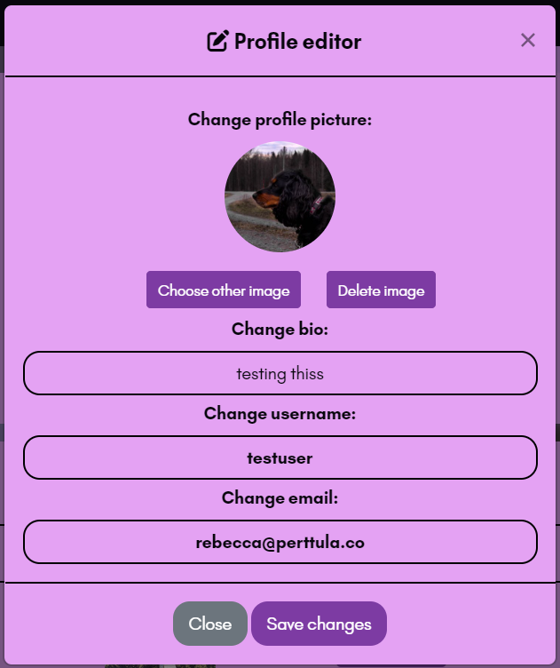

# **AboutMe**

# 1. Introduction

AboutMe is a site for sharing images. 

On the site, users can share their stories in images in combination of text posts.

Users are able to follow their favourite people to easily find their content on the front page, and perhaps upload comment encouraging words on the posts they like.

# 2. Features and UX

## **Features**

---

### **Landing Page**

When first opening the site, the user lands on the posts page

Here they have the opportunity to search posts based on their title

### **Login/logout**

If they aren't logged in since earlier they can do so by clicking the login button (or on mobile, the login link inside navigation menu).

This opens up the modal for login.

### **Signup**

If the user has no account and wish to create one, the login modal has a button toggling the signup modal.

Here they enter a username, email and password, and accept the terms of use as well as the privacy notice.

After creating an account, they may log in using the details provided.

### **Account Page**

To easily see and manage their own posts, and edit their account, the user can go to the account page.

Upon clicking the 'Edit Profile' button they are prompted with a profile editor modal.

If they wish to change their profile picture they are prompted with a cropping tool, to ensure the image will have a 1:1 aspect ratio and not get distorted.

Here they can zoom in/out and rotate the photo.

### **Following Users**

Users can follow each other by clicking the user icon with a plus, in the user detail page. If they already are following them there is a minus instead, with the text 'following' next to the username.

Following allows the user to now, on the post page, browse posts by the users they are following.

### **Tables**

---

## **UX**

### **Typography**

I wanted to choose an easy-to-read font with a modern feel and chose Glacial Indifference, both regular and bold variants.

### **Colours**

Below are the main colours used on the site:

---

# 3. Wireframes

# 4. Testing

## **Manual testing**

## **Lighthouse**

# 5. Dependencies

1. **Django Client Side Image Corpping**
2. **Django CORS-headers**
3. **Django Inlineedit**
4. **Django Storages**
5. **Gunicorn**
6. **Django Markdown**
7. **Pillow**
8. **Python-decouple**
9. **Selenium**
10. **Whitenoise**

# 6. Bugs

## **Fixed**

---------------

    Bug 🐝: Submitting any form would instead of submitting the form in question try to submit a login request

    Cause 🛠: Logging in was handled as a middleware which was looking for any post request, not just for the login form

    Fix 💚: Move login to a view instead

---------------

    Bug 🐝: On the page showing posts of followed users, it showed the current user's posts instead

    Cause 🛠: The queryset filter wasn't properly configured in the view

    Fix 💚: Modify the filter to get posts of followed users

---------------

    Bug 🐝: Images submitted in forms weren't processed - causing no errors but also not uploading the image to storage

    Cause 🛠: Form didn't have the correct 'enctype' attribute

    Fix 💚: Add the attribute enctype='multipart/formdata' to the HTML form element, and modify the views handling form submittion to also look for files in the post request

---------------

## **Persistent**

---------------

    Bug 🐝: Line breaks in post text content are not shown for post owners in the post page

    Cause 🛠: Inlineedit gets the field separately from normal attributes which doesn't allow me to add the 'linebreaks' filter to the field

    Fix 💚: Perhaps write my own module for inline editing that allows this/figure out a way to in the textarea adaptor for the add this functionality

---------------

# 7. Deployment

# 8. Future Enhancements

- Add the possibility to message other users on the platform
    Having the possibility of messaging other users privately, not only through comments would enhance user experience and allow for networking
- Show users who are currently online in a sidebar
    Together with messaging functionality it would be great to see who is currently online
- Show line breaks for post owners on the post page
    When viewing your own posts, due to the way post editing is implemented it's not possible to filter the text content by linebreaks
- Allow for users to optionally upload bio/profile picture when signing up
    Currently this is only possible after signing up due to the way signing up is implemented
- Add tags on posts to create the possibility of enhanced filtering
- When searching for posts, also query text content and tags
    Currently the view only lists posts based on their title, it would be good to also query text content as it is available
- Show user the people that follow them somewhere on the account page
    Currently the page only shows the number of followers, I'd like to perhaps show a list of them as well as add notifications on new followers
- Implement user-configurable theming
    I already started working on this by adding a column to the profile model for dark mode, though the feature is not implemented yet (I need to create work on a separate dark mode stylesheet),
    and it would make more sense for me to just impelment a fully configurable theme instead

# 9. Credits

# 10. Links

[logo]: images/logo.png
[tables]: images/tables.png
